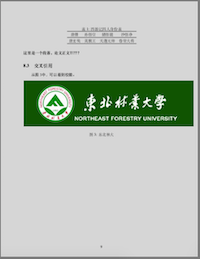

#毕业之前的琐事
##毕竟要写总是要写毕业论文的
- 想尝试使用原来用的LaTeX来写找了好多模板，发现自己根本不清楚里面的东西，决定自己做一个，也是回顾自己学过的东西，做过之后才发现自己还有好多需要搜索和学习
- 先上效果图<br>



- 奉上源码，以此为始

```
\documentclass[UTF8, 12pt]{article}
\usepackage{geometry}
\usepackage{ctex}
\usepackage{amsmath}
\geometry{left=2.5cm, right=2cm, top=2.5cm, bottom=2cm}
\usepackage{graphicx}
\usepackage{fontspec}
\setmainfont{Times New Roman}
\usepackage{subfigure}
\usepackage{caption2}
\usepackage{float}

\makeatletter
\renewcommand*\maketitle{
	\begin{center}
		\bfseries
		{\Huge\@title\par}
		\vskip 9em %标题下有10em缩进
		{\global\let\author\@empty}
		{\global\let\date\@empty}
		\thispagestyle{empty}
	\end{center}
	\setcounter{footnote}{0}		
}
\makeatother

\title{\includegraphics{nefu.png}\\本科学生毕业论文}
\author{}
\date{}

\begin{document}
	\maketitle
	\begin{table}[!h]
		\centering\bfseries
		\begin{tabular}{ll}
		\LARGE{论文题目：} & \huge{XXXXXX系统}
		\end{tabular}
	\end{table}
	\vskip 11em
	\begin{table}[!h]
		\centering\bfseries
		\begin{tabular}{lc}
		\Large{学生：} & \Large{XXX}\\
		&\\
		\Large{指导老师：} & \Large{XXX}\\
		&\\
		\Large{学院名称：} & \Large{XXXXX学院}\\
		&\\
		\Large{专业名称：} & \Large{XXXXXXXX}\\
		&\\
		\Large{年级班级：} & \Large{XXX级XXXX班}\\
		\end{tabular}
	\end{table}
	\vskip 1cm
	\begin{center}
		\bfseries
		\large{\today}
	\end{center}
	\newpage
	
	\begin{center}
		\heiti{\Large{XXXXXXXX系统}}
	\end{center}
		\begin{abstract}
		\small{这是摘要部分}
		\newline
		\newline
		\heiti{\normalsize{\bf{关键字：}}} {
		<关键字>；
		<关键字>
		}
	\end{abstract}
	\thispagestyle{empty} 
	\newpage
	
	\begin{center}
		\heiti{\Large{XXXXXXXXX系统}}\\
		\large{\textbf{Abstract}}
	\end{center}
	asdfg
	 \newline
	 \newline
	 \heiti{\normalsize{\bf{Keywords：}}} {
	<Keywords>；
	<Keywords>
	}
	\thispagestyle{empty}       %本页不显示页码
	\newpage                    %分页

	\tableofcontents   % 生成目录
	\thispagestyle{empty}   % 目录页不显示页码
	\newpage


	\setcounter{page}{1}   %从下面开始编页码
	\section{绪论}
		\subsection{研究背景及意义}
		\subsection{设计定义与简介}
		\subsection{国内外发展状况分析}
			\subsubsection{国内发展状况分析}
			\subsubsection{国外发展状况分析}	
		\subsection{论文各章内容介绍}
	\newpage
	\section{需求分析}
		\subsection{功能分析}
		\subsection{设计原则}
		\subsection{可行性分析}
			\subsubsection{可行性分析的目的}
			\subsubsection{技术可行性分析}
			\subsubsection{操作可行性分析}
			\subsubsection{系统开发及运行环境}
	\newpage
	\section{系统实现主要技术详解}
		\subsection{技术}
	\newpage
	\section{分层设计}
	\newpage
	\section{数据库设计}
	\newpage
	\section{详细模块设计}
		\subsection{用户模块设计}
		\subsection{管理模块设计}
	\newpage
	\section{测试运行}
		\subsection{功能性测试}
		\subsection{性能性测试}
	\newpage
	\section{表格图片使用记录}
	\subsection{二级标题一}
		\paragraph{这里是一个段落，论文正文}
			\subsubsection{三级标题一}
			\paragraph{这里是一个段落，论文正文}
			\subsubsection{三级标题二}
			\paragraph{这里是一个段落，论文正文}
		\subsection{二级标题二}
		\paragraph{这里是一个段落，论文正文}
			\subsubsection{三级标题一}
			\paragraph{这里是一个段落，论文正文}
			$\sin(x)$在数学中是三角函数中的一种，即为正弦函数.
			$$\sin(x)$$
			\subsubsection{三级标题二}
			\paragraph{这里是一个段落，论文正文}
			\paragraph{这里是一个段落，论文正文!!!???}
			\begin{figure}[htbp] %htbp 代表图片插入位置的设置
			\centering %图片居中
			\includegraphics[width=5cm]{nefu.png} %[]中可选参数，可以设置图片的宽高
			\caption{东北林业大学}
			\end{figure}
			\begin{figure}[H]
				\centering
				\subfigure[场景1]{
    					\includegraphics[width=0.45\textwidth]{nefu.png} 
				}
				\subfigure[场景2]{
					\includegraphics[width=0.45\textwidth]{nefu.png}
				}
				\caption{双图模式}
				\label{wolf2}
			\end{figure}
			\begin{table}[htbp] %htbp代表表格浮动位置
				\centering
				\caption{啦啦啦啦}
				%创建table环境
				\begin{tabular}{cccc} 
					\hline  %一条水平线
					唐僧 & 孙悟空 &猪悟能 &沙悟净\\ %\\为换行符
					\hline
					唐玄奘 &美猴王 &天蓬元帅&卷帘大将\\
					\hline
				\end{tabular}
			\end{table}
	
		\subsection{交叉引用}
		从图\ref{东北林大}中，可以看到校徽。
		\begin{figure}[htbp]
			\centering
			\includegraphics[height=5cm]{nefu.png}
			\caption{东北林大}
			\label{东北林大}
		\end{figure}
	
	\appendix
	\newpage
	\section{附录}
	\subsection{程序代码}
	\subsubsection{冒泡排序代码}
	\subsubsection{Python代码}
	
	\newpage
	\section*{致谢}
	\addcontentsline{toc}{section}{致谢} %添加致谢到目录
	\newpage
	
	\begin{center}
		\Large{毕业论文评审意见表A}	
		\\
	\end{center}
		\begin{table}[!htbp]
			\centering\large
			\begin{tabular}{|l|l|}
			\hline
			毕业论文题目&文档自动整理系统\\
			\hline
			学生姓名&\\
			\hline
			专业班级&\\
			\hline
			指导老师评语&\\
			\hline
			建议成绩:&\\
			指导老师（签字）：&\\
			&年\ 月\ 日\\
			\hline
			\end{tabular}
	\end{table}
\end{document}
```
