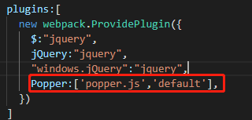

<style type="text/css">
p, h4, h5 { 
text-indent:2em;
}

td {
	text-align: center;
}

.now {
	background-color: lightblue;
}

.end {
	background-color: red;
}

.begin {
	background-color: lightgreen;
}

.firstPotEnd, .secondPotEnd, .thridPotEnd {
	background-color: orange;
}
</style>

<h1>Sig文档整理搭建记录</h1>
<h2>前言</h2>

<h5>本记录拟用生命周期法的方式来记录“Sig文档整理平台”（以下简称该平台）整个开发过程，仅记录了2月7日及以后关于该平台的相关事项</h5>
<h6>TencentCloud的使用记录不适合记录开发中的小点和规划。所以就由该文档来记录具体各container的内部细节，也是我的毕业设计过程的一个记录。</h6>
<h2>系统规划阶段</h2>
<h3>系统开发背景</h3>
<p>在当今社会，拥有几个G的数据非常常见，集中式的数据爆炸后，开始向个人用户辐射。个人文档数量明显增加，然而个人用户有效文档占总文档的比重在不断减小，其中重要的原因就是<b>个人用户对于文档的有效整理与重用率不高</b>。能够快速查找到希望找到的文档，能够根据个人个性化的整理文档，成为一个亟待解决的问题。</p>
<p>在个人使用系统的过程中，文档的合理分类将占据文档使用的时间的一半，多次的修改文档的整理方式。使用时，会忘记文档位置与关键词，全局关键词搜索受限。在团队合作时，沟通交流是必不可少的，说明自己所掌握的知识库并了解团队成员的知识库，是一个团队不断前进的方法。因此，一款能将个人文档系统整理，个性化整理，团队文档与知识库整理的系统是不二选择。</p>
<h3>系统的目标</h3>
<p>1. 方便广大办公人士对工作生活文件进行分类，并帮助其提取知识与相关知识文件的寻找</p>
<p>2. 方便团队或组织对团队文档进行管理，帮助团队内部成员进行团队共同知识的学习</p>
<h3>初步调查: 明确系统开发的目标和规模</h3>
<h4>明确目标:</h4>
<p>1. 实现个人用户文档的有序管理,辅助用户进行文档的整理分类工作</p>
<p>2. 辅助用户对文档进行知识点提取与知识分享</p>
<p>3. 实现团队文档的合理管理，辅助团队知识体系管理</p>
<h4>规模:</h4>
<p>可访问到互联网的对文档整理有需求的人群</p>
<p>受个人知识限制，当前无法评估系统规模，但预估应能承受500-1000人的并发使用</p>
<h4>普通用户</h4>
<p>1. 对个人文档进行上传、下载、分享与删除</p>
<p>2. 系统辅助进行分类</p>
<p>3. 根据文档知识需求能检索相关文档</p>
<p>4. 组建、加入和退出团队</p>
<h4>团队管理者</h4>
<p>1. 团队成员功能及以下</p>
<p>2. 当前团队内成员进行管理</p>
<p>3. 能发信息或提醒团队内成员</p>
<h4>团队成员</h4>
<p>1. 对当前团队成员公开的文档下载</p>
<p>2. 能获取团队的实时动态</p>
<p>3. 能发表自己的动态</p>
<h3>可行性研究</h3>
<h4>分析系统开发的必要性</h4>
<p>1. 为解决个人毕业需求所做毕业论文的材料</p>
<p>2. 为学习相关开发步骤和开发阶段，以用到实际公司的开发过程中</p>
<p>3. 解决在实际文档工作中，文档整理问题</p>
<h4>技术可行性</h4>
<p>1. 本人已对该系统的技术要点进行了实地的实验与学习，已能初步的进行系统的实际编码，并能实现部分需求</p>
<p>2. 能确实的解决一部分人的文档的整理工作</p>
<p>该网站的开发是建立在成熟可靠的技术基础上的，拟以MySQL为数据库，redis数据库加速。应用html、css、javascript等语言，结合vue、Django框架完成该网站的前端、后端以及数据库部分的开发，使用Nginx和Apache实现动静分离从而保证建立一个有效运行、功能完善的在线平台。</p>
<h4>操作可行性</h4>
<p>该网站的页面设计欲以简洁、直观为主，功能设计欲以实用、便捷为主，操作简单，功能完整，对于任何一个文件分类和知识共享需求的个人或群体来说，只要掌握简单的网站操作便可以轻松驾驭该网站所提供的所有功能模块，花费少量的时间便能够对网站的各种操作得心应手。</p>
<h4>社会可行性</h4>
<p>该网站将文档分类和知识共享相结合，能够促进各类群体内部的知识通过文档的形式在各个成员以及外界环境中进行传播，从而提高团队协作的效率、丰富组织的知识库、提高企业的核心竞争力。</p>
<h3>初步方案</h3>
<p><b>本部分文档撰写于2020年2月7日</b></p>
<table>
	<tr><th></th><th colspan="3">2020年</th><th colspan="2">二月</th><th></th></tr>
	<tr><th>周日</th><th>周一</th><th>周二</th><th>周三</th><th>周四</th><th>周五</th><th>周六</th></tr>
	<tr><td>2</td><td>3</td><td>4</td><td>5</td><td>6</td><td class="begin">7</td><td class="">8</td><td>本周完成整体系统的规划</td></tr>
	<tr><td>9</td><td>10</td><td>11</td><td>12</td><td>13</td><td>14</td><td>15</td><td>本周完成整体系统的分析与设计</td></tr>
	<tr><td>16</td><td>17</td><td>18</td><td>19</td><td>20</td><td>21</td><td>22</td><td>前端后台数据库数据连接的实现</td></tr>
	<tr><td>23</td><td>24</td><td>25</td><td>26</td><td>27</td><td>28</td><td>29</td><td>前端三级框架的实现</td></tr>
	<tr><td>30</td><td></td><td></td><td></td><td></td><td></td><td></td></tr>
	
	<tr><th></th><th colspan="3">2020年</th><th colspan="2">三月</th><th></th></tr>
	<tr><th>周日</th><th>周一</th><th>周二</th><th>周三</th><th>周四</th><th>周五</th><th>周六</th></tr>
	<tr><td></td><td>1</td><td>2</td><td>3</td><td>4</td><td>5</td><td>6</td><td>团队增删改查功能实现</td></tr>
	<tr><td>7</td><td>8</td><td>9</td><td class="firstPotEnd">10</td><td class="now">11</td><td>12</td><td>13</td></tr>
	<tr><td>14</td><td>15</td><td>16</td><td>17</td><td>18</td><td>19</td><td>20</td></tr>
	<tr><td>21</td><td>22</td><td>23</td><td>24</td><td>25</td><td>26</td><td>27</td></tr>
	<tr><td>28</td><td>29</td><td>30</td><td class="secondPotEnd">31</td><td></td><td></td><td></td></tr>
	
	<tr><th></th><th colspan="3">2020年</th><th colspan="2">四月</th><th></th></tr>
	<tr><th>周日</th><th>周一</th><th>周二</th><th>周三</th><th>周四</th><th>周五</th><th>周六</th></tr>
	<tr><td></td><td></td><td></td><td></td><td>1</td><td>2</td><td>3</td></tr>
	<tr><td>4</td><td>5</td><td>6</td><td>7</td><td>8</td><td>9</td><td>10</td></tr>
	<tr><td>11</td><td>12</td><td>13</td><td>14</td><td>15</td><td>16</td><td>17</td></tr>
	<tr><td>18</td><td>19</td><td class="thridPotEnd">20</td><td>21</td><td>22</td><td>23</td><td>24</td></tr>
	<tr><td>25</td><td>26</td><td>27</td><td>28</td><td>29</td><td>30</td><td class="end">31</td></tr>
</table>
<h4>1.6日原计划</h4>
<p>1. 三月中旬就要去实习了，所以想在三月中旬前写出来程序，算下来一共11周时间，去掉过年的一周，就剩下10周时间了，五个模块10周，两周一个模块。</p>
<p>2. 当前版本是V1.1.4标志着第一版程序的第一个功能的第4次进步。</p>
<p>3. 从1.6-1.19开发第一个功能模块（文档管理模块）</p>

<h4>第一阶段</h4>
<p>1. 初步搭建B/S模型：一方面减少因系统带来的开发问题，另一方面减少因软件平台而带来的使用限制性</p>
<p>2. 完成系统的前端后台的基本功能</p>

<h5>实际情况</h5>
<p>1. 框架搭建完成，登录模块，文档管理模块，团队管理模块大体完成</p>
<p>2. 知识库生成模块与互动模块未完成</p>

<h4>第二阶段</h4>
<p>回顾大体功能，并总结相关技术点，查阅相关文章文献，为撰写毕业设计说明书做准备</p>
<p>检测系统bug，上线进行测试，并修复相关bug</p>
<h4>第三阶段</h4>
<p>撰写毕业设计说明书</p>

<h2>系统分析阶段</h2>
<h3>一、明确用户的信息系统需求</h3>
<h4>1. 用户注册与登录功能</h4>
<p><input type="checkbox" checked></input>1) 使用邮箱进行用户标注与识别注册</p>
<p><input type="checkbox" checked></input>2) 记录用户登录状态</p>
<p><input type="checkbox" checked></input>3) 能使用邮箱和用户名进行登录</p>
<h4>2. 文档管理与自动分类</h4>
<p><input type="checkbox" checked="checked"></input>1) 用户可上传文件，并做提交tag</p> 
<p><input type="checkbox" checked="checked"></input>2) 实现下载与删除功能</p>
<p><input type="checkbox"></input>3) 文件压缩存储</p>
<p><input type="checkbox"></input>3) 支持自动个性化分类</p>
<p><input type="checkbox"></input>4) 支持少量的代码文档类型</p>
<p><input type="checkbox"></input>5) 支持注册用户在网站上创建知识库或文档，并存储到服务端数据库</p>
<p><input type="checkbox"></input>6) 公开文档会在网站内展示给所有用户</p>
<p><input type="checkbox"></input>7) 提供站内搜索，迅速检索相应用户、标题或内容的文档</p>
<p><input type="checkbox"></input>8) 可以对感兴趣的内容进行关注订阅或收藏</p>
<p><input type="checkbox"></input>9) 用户可随时对文件进行编辑</p>
<p><input type="checkbox"></input>10) 可以为文档和知识库增加标签（即关键字）</p>
<p><input type="checkbox"></input>11) 可以向用户自动推送关注的用户最近更新的知识库</p>
<p><input type="checkbox"></input>12) 支持识别用户上传的文档类别并归类存储</p>
<p><input type="checkbox"></input>13) 支持多种文档的不同分类方式</p>
<h4>3. 好友管理</h4>
<p><input type="checkbox" checked></input>可以搜索用户并可以关注网站上的其他的用户</p>
<p><input type="checkbox" checked></input>可以给关注或粉丝留言</p>
<h4>4. 团队协作功能</h4>
<p><input type="checkbox" checked></input>1) 注册用户可在网站创建、加入、退出团队</p>
<p><input type="checkbox"></input>2) 用户可设置文档或知识库的权限，使文档或知识库仅选择的团队内部可见</p>
<p><input type="checkbox"></input>3) 团队成员可集体对文档和知识库进行在线编辑、管理</p>
<p><input type="checkbox"></input>4) 用户已加入的团队及其文档会在用户主页单独显示</p>
<p><input type="checkbox"></input>5) 设置讨论区块，团队创建者可以发布issue，让团队成员能够集中讨论工作中遇到的问题，交流经验</p>


<h3>二、系统详细调查与分析</h3>
<h4>金山文档概况分析</h4>
<h5>组织结构图</h5>
<table>
	<tr><th colspan="3">企业拥有者（超级管理员）</th></tr>
	<tr><th>系统管理员（普通管理员）</th><th>部门管理员</th><tr>
	<tr><td colspan="3">普通用户</td></tr>
	<tr><td colspan="3">文档</td></tr>
</table>
<h5>管理功能图</h5>
<table>
	<tr><th colspan="12">金山系统</th></tr>
	<tr><th colspan="12">企业主页</th></tr>
	<tr><td colspan="2">团队管理</td><td colspan="3">团队文档（类似个人）</td><td colspan="2">成员管理</td><td colspan="4">后台管理</td><tr>
	<tr><td>创建</td><td>...</td><td>分享与协作</td><td>标记</td><td>...</td><td>邀请</td><td>审批</td><td>概况</td><td>组织架构</td><td>订单管理</td><td>设置</td></tr>
</table>

<table>
	<tr><th colspan="12">金山系统</th></tr>
	<tr><th colspan="12">个人首页</th></tr>
	<tr><td colspan="6">文档管理</td><td colspan="3">消息管理</td><td colspan="3">应用管理</td><tr>
	<tr><td>新建</td><td>最近</td><td>星标</td><td>文档目录</td><td>共享</td><td>搜索</td><td>提到你</td><td>文件助手</td><td>成员申请与提醒</td><td>日历待办</td><td>通讯录</td><td>表单</td></tr>
</table>
<h4>发现现行系统存在的问题</h4>
<p>暂未发现明显问题</p>

<h3>三、提出新系统逻辑方案</h3>
<h4>提出新系统的改进方案</h4>
<h5>业务流程图</h5>
<h5>数据流程图</h5>

[0层图](https://kdocs.cn/l/spSv3mVMa?f=502)
[1层图](https://kdocs.cn/l/s77TW1cqA?f=130)

<h5>数据字典</h5>
<table>
	<tr><th>表名</th><th>User</th></tr>
</table>

<h2>三、系统设计阶段</h2>
<h3>总体结构设计</h3>
<table>
	<tr align=center><th colspan="1">Public</td><th colspan="4">Docker net [daniel-net]</td></tr>
	<tr><td colspan="2"><b>Vue-Nginx 前端管理服务器</b>
		<table><tr align=center><th>前端框架</th><th>静态页面处理</th></tr><tr align="center"><td>Vue</td><td>Nginx</td></tr></table></td><td><b>Apache-Django 后台管理服务器</b>
		<table><tr><th>动态部署</th><th>页面生成</th></tr><tr><td>Apache</td><td>Django</td></tr></table></td><td colspan="2"><b>数据库服务器</b>
		<table><tr><th>缓存</th><td>Redis</td></tr><tr><th>磁盘</th><td>Mysql</td></tr></table></td></tr>
	<tr align=center><th>BASE</th><td>vue-nginx</td><td>apache-django</td><td>redis</td><td>mysql</td></tr>
	<tr><th colspan="5">各版本及实现功能</th></tr>
	<tr align=center><td>V1.0.1</td><td>支持vue</td><td>支持HCJS</td><td colspan="2">支持本地服务</tr>
	<tr align=center><td rowspan="2">V1.0.2</td><td colspan="2">自动化部署</td></tr>
	<tr align=center><td colspan="2">支持动静分离</td></tr>
	<tr align=center><td>V1.0.3</td><td>支持HTTPS</td><td>链接并调用数据库</td><tr>
	<tr align=center><td>V1.1.3</td><td>基本前端页面跳转</td><td>文档的接收与存储</td></tr>
	<tr align=center><td>V1.1.4</td><td>文档上传、下载与删除</td><td>文档的接收与存储</td><td>文件存储与用户存储</td></tr>
	<tr align=center><td>V1.1.5</td><td>手机端显示问题</td></tr>
	<tr align=center><td>V1.1.4</td><td>多文档上传</td><td>多文档的接收与存储</td></tr>
</table>

<h3>详细设计</h3>
<h4>1. 组织机构与功能分析</h4>

<h4>2. 代码设计</h4>

<h4>3. 数据库逻辑与物理设计</h4>


<h4>4. I/O设计</h4>

<h4>5. 模块结构与功能设计</h4>
<p>1. 用户注册登录模块：用户注册、登录和密码找回</p>
<p>2. 文档管理模块：文档的新建、编辑、发布、搜索以及删除</p>
<p>3. 知识库管理模块：知识库的建立、搜索、删除以及目录管理</p>
<p>4. 团队管理模块：团队的建立、搜索、删除以及讨论区主题的发布</p>
<p>5. 互动模块：热门文章和知识库浏览、关注、收藏以及参与话题讨论</p>
<p>6. 系统模块：个人信息编辑、用户管理、退出</p>

<h4>6. 设计方案报告</h4>

<h2>四、系统实施阶段</h2>
<h3>编程记录</h3>
<h4>前端Vue框架</h4>
<h5>代码目录结构</h5>
<center>
	<table>
		<tr><th colspan="6">docker-vue / src</th></tr>
		<tr><td>App.vue</td><td>assets</td><td>components</td><td>main.js</td><td>router</td><td>Vuex</td></tr>
	</table>
</center>
<h6>router</h6>
<table>
	<tr><th rowspan="6">index.js</th><td>/</td></tr>
	<tr><td rowspan="4">/index</td><td>''</td></tr>
	<tr><td rowspan="1">signIn</td><td>''</td></tr>
	<tr><td rowspan="1">signUp</td><td>''</td></tr>
	<tr><td rowspan="1">signIng</td><td>''</td></tr>
	<tr><td rowspan="1">*</td></tr>
	
	<tr><th rowspan="6">home.js</th><td rowspan="6">/home</td><td>''</td></tr>
	<tr><td rowspan="5">friends</td><td>''</td></tr>
	<tr><td>talk</td></tr>
	<tr><td>find</td></tr>
	<tr><td>setter</td></tr>
	<tr><td>makePaty</td></tr>
	
	<tr><th rowspan="2">fileManager.js</th><td rowspan="2">/fileManager</td><td>''</td></tr>
	<tr><td>files</td></tr>
	<tr><td>fileLoad</td></tr>
	
	<tr><th rowspan="4">team.js</th><td rowspan="4">/team</td><td>''</td></tr>
	<tr><td>/worker</td></tr>
	<tr><td>/maker</td></tr>
	<tr><td>/setter</td></tr>
	
	<tr><th>knowNet.js</th><td rowspan="1">/knowNet</td><td>/</td></tr>
	
	<tr><th>setter.js</th><td rowspan="1">/setter</td><td>/</td></tr>
</table>

<h6>components</h6>

<table>
	<tr><th rowspan="3">public</th><td>Header.vue</td></tr>
	<tr><td>Footer.vue </td></tr>
	<tr><td>Error.vue</td></tr>
	
	<tr><th rowspan="5">index</th><td>Index.vue </td></tr>
	<tr><td rowspan="1">views</td><td rowspan="1">index.vue</td></tr>
	<tr><td rowspan="3">cards</td><td>signIn.vue</td></tr>
	<tr><td rowspan="1">signIng.vue</td></tr>
	<tr><td rowspan="1">signUp.vue</td></tr>
	
	
	<tr><th rowspan="16">home</th><td>Home.vue</td></tr>
	<tr><td rowspan="1">views</td><td rowspan="1">home.vue</td></tr>
	<tr><td rowspan="5">cards</td><td>userMenu.vue</td></tr>
	<tr><td>fileListCard.vue</td></tr>
	<tr><td>showFilesCard.vue</td></tr>
	<tr><td>upLoadCard.vue</td></tr>
	<tr><td>askMsgList.vue</td></tr>
	
	<tr><th rowspan="9">friends</th><td>friends.vue</td></tr>
	<tr><td rowspan="2">views</td><td>friends.vue</td></tr>
	<tr><td>friendsMenu.vue</td></tr>
	<tr><td rowspan="6">cards</td><td>friendInfo.vue</td></tr>
	<tr><td rowspan="1">talkBox.vue</td></tr>
	<tr><td rowspan="1">follower.vue</td></tr>
	<tr><td rowspan="1">following.vue</td></tr>
	<tr><td rowspan="1">friendFinder.vue</td></tr>
	<tr><td rowspan="1">initBox.vue</td></tr>


	<tr><th rowspan="8">fileManager</th><td>FileManager.vue</td></tr>
	<tr><td rowspan="2">views</td><td>fileManager.vue</td></tr>
	<tr><td rowspan="1">fileLoad.vue</td></tr>
	<tr><td rowspan="5">cards</td><td>cloudFiles.vue</td></tr>
	<tr><td rowspan="1">starFiles.vue</td></tr>
	<tr><td rowspan="1">shareFiles.vue</td></tr>
	<tr><td rowspan="1">download.vue</td></tr>
	<tr><td rowspan="1">upload.vue</td></tr>
	
	
	<tr><th rowspan="10">teams</th><td>teams.vue</td></tr>
	<tr><td rowspan="3">views</td><td>teams.vue</td></tr>
	<tr><td rowspan="1">teamsSetter.vue</td></tr>
	<tr><td rowspan="1">teamMaker.vue</td></tr>
	<tr><td rowspan="6">cards</td><td>teamMenu.vue</td></tr>
	<tr><td rowspan="1">follower.vue</td></tr>
	<tr><td rowspan="1">following.vue</td></tr>
	<tr><td rowspan="1">initBox.vue</td></tr>
	<tr><td rowspan="1">teamBox.vue</td></tr>
	<tr><td rowspan="1">teamSetter.vue</td></tr>
		
		
	<tr><th rowspan="3">knowNet</th><td>knowNet.vue</td></tr>
	<tr><td rowspan="1">views</td><td>knowNet.vue</td></tr>
	<tr><td rowspan="1">cards</td><td></td></tr>
	
	
	<tr><th rowspan="3">setter</th><td>setter.vue</td></tr>
	<tr><td rowspan="1">views</td><td>setterView.vue</td></tr>
	<tr><td rowspan="1">cards</td><td></td></tr>
	
	</table>

<h5>Bootstrap框架</h5>

[安装Bootstrap教学链接](https://www.cnblogs.com/wangpengblog/p/10594652.html)

<h3>原因</h3>

因为bootstrap依赖jquery，所以在使用npm安装bootstrap前先安装jquery
又因为jquery以来popper.js，所以在安装jquery之前先安装popper
所以安装过程分为三步：1. 使用npm安装popper。2. 使用npm安装jquery。3.使用npm安装boostrap 
 
###一、使用npm安装popper
1. 在build目录下的webpack.base.conf.js中加入

	```py
	const webpack = require("webpack");
	```
2. 在webpack.base.conf.js中module.exports找到plugins（如没有就创建），并添加上

	```py
	plugins: [
     new webpack.ProvidePlugin({
	   Popper:['popper.js','default'],
     })
   ]
	```


3. 使用npm安装popper

	```sh
	$ npm install popper.js --save-dev
	```

###二、使用npm安装jquery
1. 在package.json文件中找到"dependencies"项，并添加以下代码到其中：

	```py
	"jquery": "^2.2.3"
	```
2. 在build目录下的webpack.base.conf.js中，在module.exports中找到resolve，在其alias项中添加：

	```py
	'jquery':'jquery',
	```
在module.exports中找到plugins，并添加以下代码：
	
	```py
	plugins: [
     new webpack.ProvidePlugin({
       $: "jquery", 
       jQuery: "jquery",
       "windows.jQuery": "jquery",
	    Popper: ['popper.js','default'],
     })
   ]
	```
3. 在main.js中加入以下代码：

	```js
	import $ from 'jquery'
	```
4. 使用npm命令安装

	```sh
	$ npm install jquery@2 install jquery@2.2.3 --save-dev
	```

###三、安装bootstrap
1. 使用npm命令安装

	```sh
	$ npm install bootstrap@3 -S
	```
2. 在需要使用的页面导入bootstrap.min.css/bootstrap.js就可以了。
	
	```js
	import 'bootstrap/dist/css/bootstrap.css'
	import 'bootstrap/dist/js/bootstrap.js'
	```


###四、vue知识点
如果在想要在router-link上添加事件的话需要@click.native这样写

VueX 两个变量依次提交修改，监听模板的执行顺序与watch函数定义顺序有关

#后台Django框架使用记录
##文件管理模块
###models 
- 文件与文件夹应该本质是一样的，只是类型不同


#MySQL与redis使用记录


#TensorFlow使用记录
##创建并配置tensorflow虚拟环境
1. 创建虚拟环境

```sh
conda create -n TF2.0 python=3.6
```

2. 初始化

```sh
conda init bash
```

3. 进入虚拟环境

```sh
conda activate TF2.0
```

4. 添加清华源为下载源

```sh 
conda config --add channels https://mirrors.tuna.tsinghua.edu.cn/anaconda/pkgs/free/

conda config --set show_channel_urls yes
```

5. 安装cuda10.0

```sh
conda install cudatoolkit=10.0
```

6. 安装cudnn7.5.1

```sh
conda install cudnn=7.5.1 -c https://mirrors.tuna.tsinghua.edu.cn/anaconda/pkgs/main/linux-64/
```

7. 安装Tensorflow2.0

```sh
pip install tensorflow==2.0.0 -i https://pypi.tuna.tsinghua.edu.cn/simple
```

8. 由于目前anaconda不支持tensorflow2.0的安装，只能用pip安装。
测试环境搭建是否成功
运行demo.py（python demo.py)，观察输出的tensorflow版本及是否使用GPU。

demo.py

```py
import tensorflow as tf
version = tf.__version__
gpu_ok = tf.test.is_gpu_available()
print("tf version:",version,"\nuse GPU",gpu_ok)
```

docker pull tensorflow/tensorflow:2.0.0a0-gpu-py3


###gRPC

<h3>2. 调试</h3>


###3. 测试

###4. 试运行

##五、系统运行阶段
###1. 运行管理
###2. 评价
###3. 分析仍存在的问题


